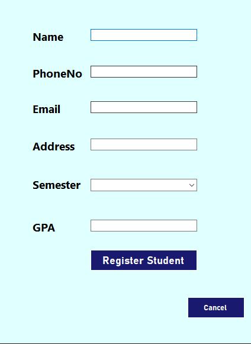
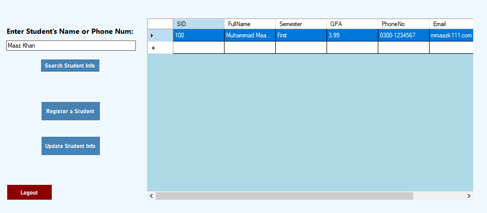
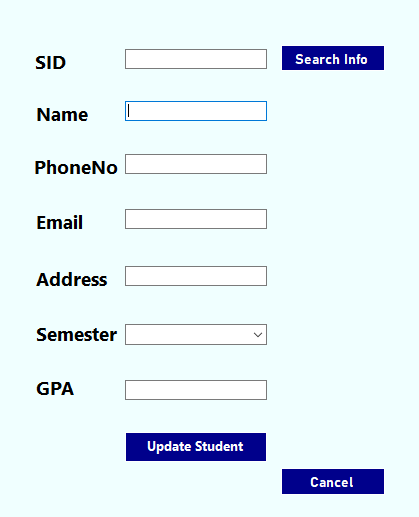

# 🎓 Student Registration Management System

A Windows Forms-based desktop application developed in **C# (.NET)** with **SQL Server** to manage student records.  
Built as a 4th semester **Database Project** at **DHA Suffa University**.

---

## 🚀 Features

- 🔹 Register new students with auto-generated unique IDs
- 🔹 Update student details from a dedicated update form
- 🔹 Search for students by **Name** or **Phone Number**
- 🔹 Delete records with confirmation via **DataGridView double-click**
- 🔹 Interactive GUI using:
  - TextBoxes, ComboBoxes, Radio Buttons, CheckBoxes
  - PictureBox for profile image or branding
  - DataGridView for displaying students
- 🔹 Structured database design with at least **3 separate tables**

---

## 🛠️ Technologies Used

| Technology    | Purpose               |
| ------------- | --------------------- |
| C# (.NET)     | Windows Forms UI      |
| SQL Server    | Backend database      |
| ADO.NET       | Database connectivity |
| Visual Studio | Project IDE           |

---

## 🧩 Database Schema Overview

The database is normalized into at least **3 tables**, based on the case study:

- `Students` – personal details
- `Contacts` – phone, email
- `Addresses` – city, region, address

All data operations (Insert, Update, Delete, Search) are performed using ADO.NET.

---

## 📂 Project Structure

Student-Registration-System/
├── Forms/ # Form1, Form2, Form3, Form4
├── Models/ # Student.cs, Contact.cs, Address.cs
├── Resources/ # Images, logos
├── Registration.cs
├── StudentModel.cs
├── App.config
├── README.md
├── .gitignore
└── CaseStudy-Students.docx

---

## 📸 Screenshots

| Register Form                         | Search Student                    | Update Form                       |
| ------------------------------------- | --------------------------------- | --------------------------------- |
|  |  |  |

---

## ✅ How to Run

1. Open the solution in **Visual Studio**
2. Update the SQL Server connection string in `App.config`
3. Press `Start` or `F5` to run the application
4. Make sure your database is up and running

---

## 👨‍💻 Developed By

- **Maaz Khan**
- **Shayan Adnan**
- **Farrukh Iqbal**
- **Mahnoor Arshad**
- **Hafiz Minhal Ali**

🎓 **4th Semester - Database Project**  
🏫 **DHA Suffa University**

---

## 🧾 License

This project is licensed under the [MIT License](https://opensource.org/licenses/MIT).

> 📘 **Note:** This project is developed purely for **educational purposes** as part of a 4th Semester Database course at **DHA Suffa University**.  
> It is not intended for commercial use or real-world deployment.
